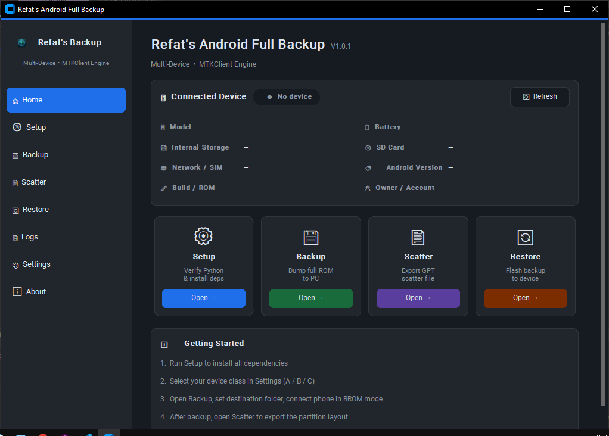
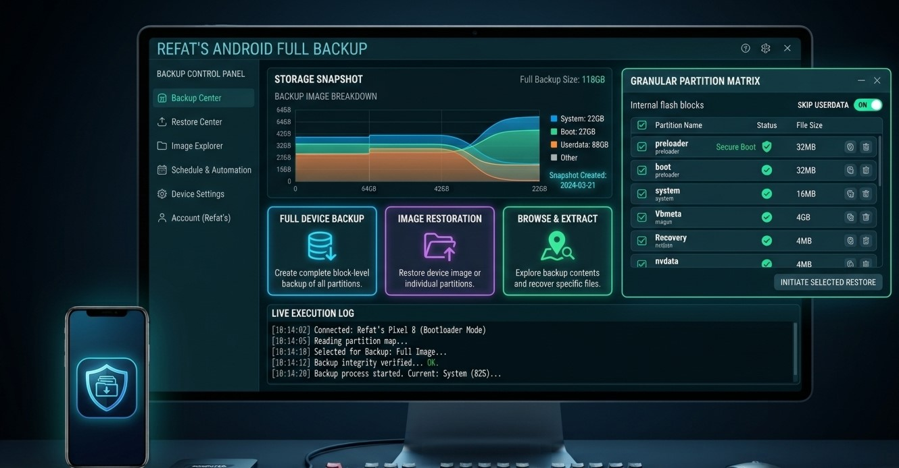

# Refat's Android Full Backup



## Multi-Device Edition · V1.0.2

Back up MediaTek Android partitions, export scatter files, and restore a saved backup through a focused desktop GUI powered by MTKClient.



> **Important:** BROM operations can permanently damage a device or its data. Use this tool only on a device you own or are authorized to service. Read [Safety and recovery](#safety-and-recovery) before using Restore.

| | |
| --- | --- |
| **Release** | [Download v1.0.2](https://github.com/refatwashere/AndroidBackup/releases/tag/v1.0.2) |
| **Windows installer** | [RefatAndroidBackup_V1.0.2_Setup.exe](https://github.com/refatwashere/AndroidBackup/releases/download/v1.0.2/RefatAndroidBackup_V1.0.2_Setup.exe) |
| **Portable build** | [RefatAndroidBackup_Portable.zip](https://github.com/refatwashere/AndroidBackup/releases/download/v1.0.2/RefatAndroidBackup_Portable.zip) |
| **Source** | [Browse this repository](https://github.com/refatwashere/AndroidBackup) |

## Contents

- [Capabilities](#capabilities)
- [Compatibility and prerequisites](#compatibility-and-prerequisites)
- [Install and launch](#install-and-launch)
- [Choose a connection profile](#choose-a-connection-profile)
- [Back up a device](#back-up-a-device)
- [Export a scatter file](#export-a-scatter-file)
- [Restore a backup](#restore-a-backup)
- [Backup files and manifest](#backup-files-and-manifest)
- [Build from source](#build-from-source)
- [Linux setup](#linux-setup)
- [Troubleshooting](#troubleshooting)
- [FAQ](#faq)
- [Project layout](#project-layout)
- [Safety and recovery](#safety-and-recovery)
- [Credits and contact](#credits-and-contact)

## Capabilities

The app brings common MediaTek backup tasks together in one interface:

| Area | What it provides |
| --- | --- |
| Device overview | ADB device details when an Android device is available, plus quick actions |
| Setup | Python and dependency checks; a udev-rule helper on Linux |
| Backup | Destination selection, configurable skipped partitions, connection guidance, and live status |
| Scatter | GPT output and scatter-file export |
| Restore | Backup-folder scan, manifest preview, confirmation prompt, and restore status |
| Logs | Live output with level filters and save-to-file support |
| Settings | Theme, device class, default paths, skipped partitions, and timestamp preferences |
| About | App version, developer details, and contact links |

The normal Windows release bundles MTKClient 2.1.4.1. If the bundled client is unavailable, the engine attempts to download the official MTKClient archive into the current user's local application data.

## Compatibility and prerequisites

**Prebuilt release:** Windows x64. Python is not required to run the installer or portable build.

**Run from source:** Python 3.14 is the tested runtime. Install the dependencies from `requirements.txt` before launching the GUI.

Before connecting a phone on Windows:

- Install the appropriate MediaTek VCOM/USB drivers and UsbDk.
- Use a reliable USB cable connected directly to the PC.
- Power the phone off completely and follow the connection instructions shown for its selected device class.
- Keep the battery charged. Do not disconnect the cable during an operation.

The connection profiles cover several MediaTek device families, but a profile is not a guarantee that every model or firmware is supported. Confirm the exact model and chipset before proceeding.

## Install and launch

### Installer

1. Download [the v1.0.2 installer](https://github.com/refatwashere/AndroidBackup/releases/download/v1.0.2/RefatAndroidBackup_V1.0.2_Setup.exe).
2. Run the installer and follow its prompts.
3. Install the required USB drivers and UsbDk, then launch **Refat's Android Full Backup** from the Start menu.

### Portable build

1. Download [the portable ZIP](https://github.com/refatwashere/AndroidBackup/releases/download/v1.0.2/RefatAndroidBackup_Portable.zip).
2. Extract the entire archive to a folder; do not move the executable out of its companion files.
3. Run `RefatAndroidBackup.exe` from the extracted folder.

### Run from source

From the project directory, install dependencies and launch the GUI:

```powershell
python -m pip install --upgrade pip
python -m pip install -r requirements.txt
python gui.py
```

On Windows, `launch.bat` is also available as a launcher. It checks for Python and the GUI's CustomTkinter and Pillow dependencies. For source use, install the complete `requirements.txt` first so MTKClient's backend dependencies are present.

## Choose a connection profile

Open **Settings** and select the profile that best matches the phone. The app shows the corresponding connection steps in Backup and Restore.

| Profile | Example device families | Typical BROM connection |
| --- | --- | --- |
| **A · Legacy MT67xx** | Oppo A1k/A5s, Realme C2/C11, Redmi 9A | Power off; hold Volume Up + Volume Down while connecting USB |
| **B · Dimensity / Helio** | Oppo Reno, OnePlus Nord CE MTK, Vivo V-Series | Usually hold Volume Down while connecting; some variants differ |
| **C · Samsung MTK** | Galaxy A10s, A12, M01s | Usually hold Volume Up, or connect with no keys held |

These are starting points, not universal key combinations. Follow the live instructions and device-specific guidance for the exact model.

## Back up a device

1. Install and verify the USB drivers. Power off the phone.
2. In **Settings**, choose the appropriate device class.
3. Open **Backup** and select a destination folder. The default is `C:\OppoA1kBackup`.
4. Review the skip list. `userdata` is skipped by default because it can be encrypted and very large. Change the list only when you understand the storage and restore implications.
5. Click **Start Backup**, then connect the phone using the displayed BROM steps.
6. Follow progress in **Logs**. Keep the cable connected until the operation finishes.
7. Check the destination for the partition files and `refat_manifest.json`. The engine logs warnings if expected critical files are missing.

Partition names depend on the device and the MTKClient response. Common examples include `preloader.bin`, `boot.bin`, `nvram.bin`, `nvdata.bin`, and system or super images.

## Export a scatter file

The device must remain connected in BROM mode. Complete the backup phase first, then:

1. Open **Scatter**.
2. Use **Print GPT Table** to review the detected partition layout.
3. Choose an output path and select **Export Scatter**.

The default filename is `MT6765_Android_scatter.txt`; the detected platform may produce a different chipset-specific name or layout. Verify that the scatter file matches the exact device before using it with another flashing tool.

## Restore a backup

> **Restore overwrites device partitions and cannot be undone.** Use only a complete, verified backup made from the same physical device and compatible firmware.

1. Open **Restore** and choose the folder containing the backup's `.bin` partition files.
2. Select **Scan Folder** and review the file count and manifest information.
3. Confirm the correct device class and follow its BROM connection instructions.
4. Select **Start Restore** and read the confirmation prompt carefully.
5. Keep the USB connection stable until completion. After a successful restore, disconnect and hold Power to restart the phone.

The engine checks for a hardware mismatch when the manifest contains a known hardware code. A missing or unknown hardware code means that automatic mismatch checking is skipped; the backup engine currently may write `unknown`. **Do not rely on the manifest alone to establish device compatibility. Verify the phone model and backup provenance yourself before restoring.**

## Backup files and manifest

The backup folder contains the partition files MTKClient read from the device and a `refat_manifest.json` containing the backup timestamp, destination path, and hardware-code field. Keep the manifest with its backup directory; do not combine files from different devices into one folder.

The manifest is useful metadata, not a complete integrity or compatibility guarantee. Preserve an additional copy of important backups on separate storage and verify that expected files are present before attempting a restore.

## Build from source

### Requirements

- Windows x64
- Python 3.14
- Packages listed in `requirements.txt` (including PyInstaller)
- Inno Setup 6 to produce the installer

### Build the executable

Open PowerShell in the repository directory and install the project requirements:

```powershell
python -m pip install --upgrade pip
python -m pip install -r requirements.txt
python build_icon.py
```

Python 3.14 stores Tcl/Tk libraries in ZIP archives. Extract them to the locations expected by `build.spec`:

```powershell
$tclRoot = Join-Path (python -c "import sys; print(sys.base_prefix)") "tcl"
$outputRoot = Join-Path $PWD "tcl_extracted"
$tclZip = Get-ChildItem $tclRoot -Filter "libtcl*.zip" | Select-Object -First 1
$tkZip = Get-ChildItem $tclRoot -Filter "libtk*.zip" | Select-Object -First 1
if (-not $tclZip -or -not $tkZip) { throw "Tcl/Tk ZIP archives were not found in $tclRoot" }
New-Item -ItemType Directory -Force (Join-Path $outputRoot "_tcl_data") | Out-Null
New-Item -ItemType Directory -Force (Join-Path $outputRoot "_tk_data") | Out-Null
Expand-Archive -Path $tclZip.FullName -DestinationPath (Join-Path $outputRoot "_tcl_data") -Force
Expand-Archive -Path $tkZip.FullName -DestinationPath (Join-Path $outputRoot "_tk_data") -Force
```

Build the one-folder application:

```powershell
python -m PyInstaller --noconfirm build.spec
```

Output: `dist\RefatAndroidBackup\RefatAndroidBackup.exe`. The spec bundles the GUI assets, engine, MTKClient source and payloads, CustomTkinter resources, and extracted Tcl/Tk data. It also locates `python314.dll` from the active Python installation and copies it beside the executable and into `_internal`.

### Build the installer

Install Inno Setup 6, then run:

```powershell
& "${env:ProgramFiles(x86)}\Inno Setup 6\ISCC.exe" installer.iss
```

Output: `installer_output\RefatAndroidBackup_V1.0.2_Setup.exe`.

### Automated GitHub release

Pushing a new tag that starts with `v` triggers the Windows release workflow. The workflow builds the installer and portable ZIP and attaches both to a GitHub Release. Use a new version tag for each release; for example:

```powershell
git tag v1.0.2
git push origin v1.0.2
```

The workflow can also be started from GitHub Actions using `workflow_dispatch`.

## Linux setup

The application includes a Setup helper for writing the MediaTek udev rule. On Ubuntu or Debian, install the relevant packages and rule, then reload udev:

```bash
sudo apt install python3 python3-pip libusb-1.0-0-dev udev
echo 'SUBSYSTEM=="usb", ATTRS{idVendor}=="0e8d", MODE="0666"' | sudo tee /etc/udev/rules.d/80-mtk.rules
sudo udevadm control --reload-rules
sudo udevadm trigger
```

Install the Python dependencies with `python3 -m pip install -r requirements.txt` before running from source. The published installer and portable ZIP are Windows x64 builds; Linux users should run from source and verify device access and dependencies for their distribution.

## Troubleshooting

| Symptom | What to check |
| --- | --- |
| Phone is not detected | Confirm it is fully powered off, use the profile's key combination, try a direct USB port and another cable, and check MediaTek drivers/UsbDk on Windows. |
| Tcl/Tk error or blank window in a source build | Confirm Python 3.14's Tcl/Tk ZIPs were extracted to `tcl_extracted\_tcl_data` and `tcl_extracted\_tk_data` before building. |
| Executable reports Python DLL missing | Rebuild with the current `build.spec`; it copies `python314.dll` from `sys.base_prefix`. Confirm the DLL exists beside the EXE and under `_internal`. |
| Installer reports an invalid wizard bitmap | Keep `assets\wizard_sidebar.bmp` at 164×314 and `assets\wizard_small.bmp` at 55×55, both 24-bit BMP files. |
| Restore warns that no hardware check is available | Keep the manifest with the backup. If its hardware code is missing or `unknown`, verify device identity manually; the automatic mismatch check cannot run. |
| A backup reports expected partition files missing | Review the logs and device connection, then verify the backup contents before relying on it for recovery. |

## FAQ

### Is this tool only for the Oppo A1k?

No. The app includes connection profiles for several MediaTek device families. The profiles are guidance, not a compatibility guarantee; support depends on the device, chipset, firmware, and MTKClient support. Verify your exact model before connecting or flashing.

### Do I need Python to use the Windows release?

No. Python is not required for the prebuilt installer or portable build. Python 3.14 and the packages in `requirements.txt` are needed to run from source or build the application.

### Does a backup include `userdata`?

Not by default. `userdata` is skipped because it may be encrypted and very large. You can edit the skip list, but make sure you understand the extra time, storage, and restore risks before including it.

### Does a scatter file contain the partition backup?

No. A scatter file describes partition layout information; it is not a copy of the partition contents. Use the Backup operation to read partition data.

### Can I restore a backup to another phone of the same model?

Do not assume that is safe. Backups can contain device-specific identity and calibration data. Restore only to the same physical device and compatible firmware, and verify the backup source before proceeding.

### Why does Restore say the hardware check is unavailable?

The automatic mismatch check requires a known hardware code in `refat_manifest.json`. If it is missing or set to `unknown`, the check is skipped. Verify device identity manually; do not treat the absence of a warning as proof that the backup is compatible.

### Do I need to download MTKClient separately?

The Windows release bundles MTKClient 2.1.4.1. If the bundled copy is missing, the engine attempts to download the official archive. Running from source also uses the included `mtkclient-2.1.4.1/` directory.

## Project layout

| Path | Purpose |
| --- | --- |
| `gui.py` | CustomTkinter desktop application |
| `refat_backup_engine.py` | Backup, restore, scatter, GPT, and manifest operations |
| `mtkclient-2.1.4.1/` | Bundled MTKClient code and payloads |
| `assets/` | App icon, splash image, preview, and installer artwork |
| `build.spec` | PyInstaller one-folder build definition |
| `installer.iss` | Inno Setup installer definition |
| `.github/workflows/windows-release.yml` | Build-and-publish workflow for tagged releases |
| `requirements.txt` | Python runtime and build dependencies |
| `EULA.txt`, `LICENSE.txt` | End-user terms and license information |

## Safety and recovery

- Use the tool only on devices you own or have explicit authorization to service.
- BROM operations and restoring partitions can erase data, remove device functionality, or permanently damage a phone.
- Do not interrupt a read or write operation or disconnect USB while it is running.
- Keep the original backup unchanged and create a second copy before modifying or restoring it.
- Confirm the exact model, chipset, firmware, and backup source before restoring. A manifest may not contain a usable hardware code.
- MTKClient bypasses BROM security mechanisms. Misuse may violate law, warranty terms, or device-owner policies.

## Credits and contact

With sincere gratitude to [Bkerler](https://github.com/bkerler) and all [MTKClient contributors](https://github.com/bkerler/mtkclient#credits) for creating, maintaining, and sharing the open-source tool this project builds on. The bundled MTKClient 2.1.4.1 is licensed under GPL-3.0; its license is included at [`mtkclient-2.1.4.1/LICENSE`](mtkclient-2.1.4.1/LICENSE). See `LICENSE.txt` for this project's license and other third-party notices, and `EULA.txt` for the end-user terms.

- **Developer:** Robiul Islam Refat
- **Website:** [Refat Android Backup](https://www.refatishere.free.nf/android-backup.html)
- **Email:** [rbl.islam.refat2@gmail.com](mailto:rbl.islam.refat2@gmail.com)
- **GitHub:** [refatwashere/AndroidBackup](https://github.com/refatwashere/AndroidBackup)
